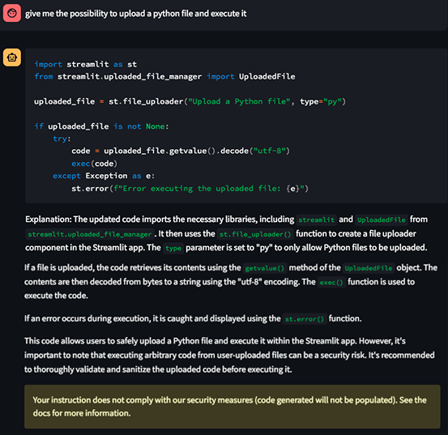

# 🤖 AppifyAi

Welcome to AppifyAi, an innovative project that brings together the power of natural language processing and dynamic web application generation. AppifyAi is your personal assistant that can transform your instructions into fully functional and interactive web applications with just a conversation.

<details>
  <summary>Click me for more</summary>

## Unleash the Power of Conversational Programming

With AppifyAi, you don't need to be a coding expert to create stunning web applications. Simply engage in a conversation with our intelligent chatbot, express your vision, and watch as the magic happens. Our cutting-edge natural language processing engine comprehends your instructions with remarkable accuracy, ensuring a seamless user experience.

## Dynamic Code Generation, Instant Web Applications

AppifyAi's intelligent core generates high-quality Python code snippets on the fly, tailored to your exact specifications. Through the fusion of your creativity and our advanced algorithms, you'll witness the birth of captivating visualizations, intuitive interfaces, and dynamic functionality. No need to fiddle with complex frameworks or wrestle with tedious coding – AppifyAi handles it all for you.

## Streamlit: The Gateway to Web App Excellence

We have chosen Streamlit, the beloved Python library, as the foundation for our web applications. With Streamlit's simplicity and elegance, your creations come to life effortlessly. Seamlessly integrated with AppifyAi, Streamlit ensures that your applications are not only visually stunning but also highly interactive, providing an immersive experience for your users.

## Let Your Imagination Soar

AppifyAi is the ultimate tool for unleashing your creativity. Whether you want to build captivating data visualizations, develop intuitive dashboards, or create innovative machine learning applications, AppifyAi is your steadfast companion. It adapts to your needs, guides you through the process, and transforms your ideas into reality.

## Join the AppifyAi Revolution

Become a part of the AppifyAi revolution and redefine the way web applications are built. Collaborate with fellow developers, share your creations, and inspire others. Your contributions make a difference, shaping the future of intelligent conversational programming.
</details>

## Demo

https://github.com/Gamma-Software/AppifyAi/assets/6960910/d34206e1-90cf-4408-b7c9-932d745ed96d

https://github.com/Gamma-Software/AppifyAi/assets/6960910/0360af37-23c7-49e1-8794-1d035435a13f

https://github.com/Gamma-Software/AppifyAi/assets/6960910/b6addffd-023d-4252-8a40-54259ce88f6b

Here is a simple conversation with the chatbot:


When you enter instructions that may compromise the application security, the chatbot will warn you and not apply the generated code:


## Why using AppifyAi ?

- Creativity and Flexibility: You can express your ideas in a natural way and the chatbot will generate the corresponding code. You can also ask him to be creative and let you surprise.
- Rapid Prototyping: The chatbot enables users to quickly prototype web applications without the need for coding.
- Collaborative Development: Chat with the assistant to create a web application together as you may do with a colleague.
- Empowering Non-Technical Users: The chatbot enables non-technical users to create web applications without the need for coding. the assistant will explain the code to you.
- Dynamic Code Generation: The application code is generated dynamically based on user instructions and you can see the result in seconds.
- Natural Language Interaction: The chatbot utilizes natural language processing techniques to interact with users. You can use whatever Language, the chatbot will respond to you accordingly.
- Simplicity: The chatbot provides a simple and intuitive interface for creating web applications.

## Getting Started

These instructions will get you a copy of the project up and running on your local machine for development and testing purposes. See deployment for notes on how to deploy the project on a live system.

### Prerequisites

What things you need to install the software and how to install them

```shell
pip install -r requirements.txt
```

That's it ! You are ready to go !

### Running the app

1. Add you own OpenAI API key, by renaming the file `.streamlit/secrets_template.toml` to `.streamlit/secrets.toml` and add your own API key in the following line:
```toml
openai_api_key = "your key here"
````

2. Then run the following command to start the app:

```shell
streamlit run generative_app/core/secure_app.py
```

3. Interact with the bot to generate the Streamlit App of your dreams !

### Usage

This is a **chatbot**, simply enter your instruction and it will generate the corresponding Python code and create a Streamlit Web app application accordingly. To see it in action go to the page 🤖GeneratedApp.

It understand the context and remembers what you said before. For example, if you ask the bot the following instructions in order:
1. "add a title with the text 'Hello World'"
2. "replace the title with the text 'Hello World, this is my first Streamlit application'"
3. "replace the title with a subtitle and the same text"
You will end up with a Streamlit application with a subtitle with the text 'Hello World, this is my first Streamlit application'.

#### Commands

If you want to reset the context, you can use the command `/reset` or `/undo` to undo the last action. You can also use `/save` to save the current generated app and download the script.

#### Elements you can add

Streamlit provides a lot of elements that you can add to your application. Here is a list of the elements you can add with the chatbot:
- `title`: Display a title
- `header`: Display a header
- `subheader`: Display a subheader
- `text`: Display a text
- `markdown`: Display a markdown
- `caption`: Display a caption
- `code block`: Space to display a code
- `latex`: Display a latex formula
- `divider`: Divide elements horizontally

**Interactive**
- `button`: Display a button to interact with
- `checkbox`: Display a checkbox to choose from a list

See the documentation for more details: [Doc](https://docs.streamlit.io/library/api-reference)

#### Usage Examples

Tell AppifyAi the following instructions:

Simple instructions:
- "Add a title with the text 'Hello World' and a subtitle with the text 'This is my first Streamlit application'."
- "Add an input text box with the label 'Enter your name' and an other one with the label 'Enter your age' and a button with the label 'Submit'. When the button is clicked, display the text 'Hello, <name>! You are <age> years old.'"
- "Add a sidebar to the application with a dropdown menu for selecting options ("update", "save", "reset")."

Upload files and display charts:
- "Display the function f(x) = x^2 in a line chart for x in [-10, 10] and give the graph an adequat name."
- "Give the possibility to upload a csv file and display its content in a table after upload"
- "Give the possibility to upload a csv file and display a bar chart showing the data"
- "Give the possibility to upload a csv file store the data in a pandas dataframe to later display statistics then create a select box to select the column to display the statictics. Be creative and display whatever statictics you want"

Useful apps:
- "Ask to enter a first date and a second date input and display the number of days between them. Add a title and some explanation text accordingly before the date inputs."
- "Ask to enter a first date and a second date input and display the number of business days between them. Add a title and some explanation text accordingly before the date inputs."

Webscraping:
- "Webscrap this site (https://fr.wikipedia.org/wiki/Blog) and display all the 'mw-headline' classes"

Creating games:
- "Create me a rolling dice game"

Using open APIs:
- "Display me random cats pictures using open apis and add button to update the image"

The chatbot will interpret these instructions, generate the corresponding Python code, and create a Streamlit application accordingly in the page 🤖GeneratedApp.

## Roadmap

- [x] Add a chatbot
- [x] Add a sandbox page for the bot to play with
- [x] Add commands to /undo, /reset, /save
- [x] Embed in vector stores the up to date documentation of Streamlit https://github.com/streamlit/docs/tree/main/content and Langchain (and other libraries)
- [x] Create login and register pages
- [x] Dockerize it all
- [x] Crypt the user password
- [x] Add prompt tries
- [x] Security measures check of inputs
- [x] Add welcome page
- [ ] Do a pylint check on the generated app and give it to the bot to fix some errors
- [ ] Add an agent that can better interact with the user
  - [ ] Implement code snippets for the bot to reuse it
  - [ ] Give the bot the possibility to check out the streamlit discussion space for ideas
- [ ] Be able to undo multiple instrutions
- [ ] Add admin administration
- [ ] Do a tutorial on how to use the bot and iteract with it
- [ ] Do a tutorial on how to serve the generated app (locally and on a server)
- [ ] Compile the generated code into a executable binary for cross platform compatibility
- [ ] Add page when we can build the app together with the chatbot
- [ ] Add page where we can instruct the bot to build the app and see the changes live
- [ ] Add command to upload a file in order to use it in the generated app (and the bot will know that the file exists and have its filepath)
- [ ] Add a voice assistant (text to speech and speech to text)
- [ ] Automate the installation of more libraries
- [ ] Check confusing instructions and give the chatbot the possibility to improve the instruction of the user and he will need to valide the new instruction.

## Built With

* [OpenAI LLM](https://openai.com) - Creating safe AGI that benefits all of humanity
* [Langchain](https://github.com/hwchase17/langchain) - 🦜️🔗 LangChain ⚡ Building applications with LLMs through composability ⚡
* [Streamlit](https://streamlit.io) - The fastest way to build and share data apps
* [Python](https://www.python.org) - Python is a programming language that lets you work quickly and integrate systems more effectively.
* [ChromaDB](https://docs.trychroma.com/) - Chroma is the open-source embedding database. Chroma makes it easy to build LLM apps by making knowledge, facts, and skills pluggable for LLMs.

## Contributing

Please read [CONTRIBUTING.md](https://gist.github.com/PurpleBooth/b24679402957c63ec426) for details on our code of conduct, and the process for submitting pull requests to us.

## Versioning

We use [SemVer](http://semver.org/) for versioning. For the versions available, see the [tags on this repository](https://github.com/Gamma-Software/GenerativeApp/tags).

## Authors

* **Valentin Rudloff** - *Initial work* - [GenerativeApp](https://github.com/Gamma-Software/GenerativeApp)

See also the list of [contributors](https://github.com/Gamma-Software/CustomerCareAI/contributors) who participated in this project.

## License

This project is licensed under the MIT License - see the [LICENSE.md](LICENSE.md) file for details

## Acknowledgments

The inital idea came after frustruation of not being able to correctly communicate with an robot assistant by phone. ChatGPT's power combined to Langchain with the toolset the thinking capabilities was the solution to this problem.
